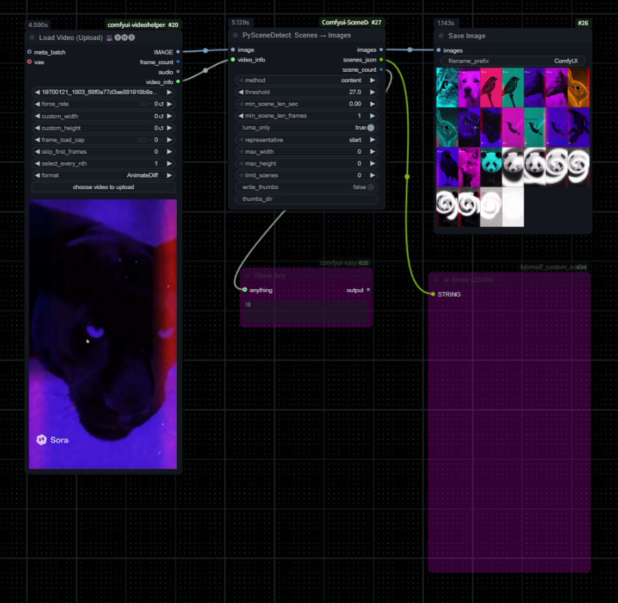

# [WIP] Comfyui-SceneDetect



Comfyui-SceneDetect is a ComfyUI custom node that uses PySceneDetect to locate scene boundaries in a video and emit one representative frame per scene as an `IMAGE` batch. It also returns per-scene metadata as JSON (`STRING`) and the total number of detected scenes (`INT`).

## Features

- Automatic scene segmentation from video files (powered by PySceneDetect)
- Export one representative frame per scene as an `IMAGE` batch (choose start/middle/end)
- Provide detailed scene metadata as JSON (frame numbers, timestamps, durations, etc.)
- Optionally store representative frames as JPEG thumbnails

## Requirements

- [ComfyUI-VideoHelperSuite (VHS)](https://github.com/Kosinkadink/ComfyUI-VideoHelperSuite): Provides the `Load Video` node that supplies `IMAGE` batches and `VHS_VIDEOINFO` metadata consumed by this node.
- [PySceneDetect](https://github.com/Breakthrough/PySceneDetect): Core scene detection engine leveraged by this custom node.

## Installation

1. Place this repository under the ComfyUI `custom_nodes` directory.
   - Example: `ComfyUI/custom_nodes/Comfyui-SceneDetect`
2. Install the Python dependencies.

   ```bash
   pip install -r requirements.txt
   ```

   The `requirements.txt` file includes:
   - `scenedetect>=0.6,<0.7`
   - `opencv-python>=4.9,<5`
   - `numpy`

   PyTorch (`torch`) ships with the standard ComfyUI installation, so it is intentionally not listed here.

3. Restart ComfyUI.

## Node Name and Category

- Node: `PySceneDetect: Scenes → Images`
- Category: `Video/PySceneDetect`

Once installed, the node can be searched and placed directly inside ComfyUI.

## Inputs and Outputs

- Required inputs
  - `image` (`IMAGE`): Connect output 1 from the comfyui-videohelpersuite (VHS) `Load Video` node. This must be an RGB frame batch (`(B,H,W,C)` or `(B,C,H,W)`). Latent batches from VAE outputs are not supported.
  - `video_info` (`VHS_VIDEOINFO`): Connect output 4 from the same node (metadata such as playback FPS). When `loaded_fps` is 0, the node falls back to `source_fps`.
  - `method` (`content|adaptive|threshold`): Scene detection method.
  - `threshold` (`FLOAT`): Detection threshold used by the `content`/`threshold` methods.
  - `min_scene_len_sec` (`FLOAT`): Minimum scene length in seconds. Preferred when FPS information is available.
  - `min_scene_len_frames` (`INT`): Minimum scene length in frames (fallback when FPS is unknown).
  - `luma_only` (`BOOLEAN`): Force detection on the luma component only.

- Optional inputs
  - `representative` (`start|middle|end`): Position of the representative frame.
  - `max_width` (`INT`): Maximum width of the representative frame (0 disables resizing).
  - `max_height` (`INT`): Maximum height of the representative frame (0 disables resizing).
  - `limit_scenes` (`INT`): Limit the number of scenes processed from the start (0 disables the limit).
  - `write_thumbs` (`BOOLEAN`): Save representative frames as JPEG thumbnails.
  - `thumbs_dir` (`STRING`): Directory for thumbnails. When empty, `scene_thumbs` is created in the working directory.

- Outputs
  - `images` (`IMAGE`): Representative frame batch (`(B,C,H,W)`).
  - `scenes_json` (`STRING`): JSON string with scene metadata (includes `video_info`).
  - `scene_count` (`INT`): Number of detected scenes.

## JSON Output Example (`scenes_json`)

```json
{
  "video_path": "",
  "video_info": {
    "loaded_fps": 29.97,
    "loaded_frame_count": 120,
    "source_fps": 29.97
  },
  "fps": 29.97,
  "method": "content",
  "threshold": 27.0,
  "min_scene_len_frames": 15,
  "representative": "start",
  "scenes": [
    {
      "index": 1,
      "start_frame": 0,
      "end_frame": 153,
      "duration_frames": 153,
      "fps": 29.97,
      "start_time": "00:00:00.000",
      "end_time": "00:00:05.105",
      "duration_sec": 5.10
    }
  ]
}
```

Each entry in the `scenes` array provides the start/end frame indices, SMPTE-style timestamps, and the duration of the scene.

## Usage in ComfyUI

1. Load a video with the VHS `Load Video` node while outputting RGB frames (do not connect a VAE).
2. Add the `PySceneDetect: Scenes → Images` node, connect `image` to output 1 and `video_info` to output 4 of `Load Video`.
3. Adjust `method`, `threshold`, and `min_scene_len_*` to match the video source.
4. Configure the representative frame position, optional resizing, and thumbnail export settings.
5. Execute the graph to receive representative frames on `images` and scene metadata on `scenes_json`.

## Project Layout

- The root `__init__.py` follows the standard ComfyUI structure and registers `nodes`.
- The node implementation lives in `nodes/pyscenedetect_to_images.py` and shared helpers reside in `utils/video_ops.py`.

## Troubleshooting

- Latent batches: If a VAE is connected to `Load Video`, its LATENT output is unsupported. Output RGB frames instead.
- Missing FPS in `video_info`: Review the `Load Video` settings (especially FPS options) to ensure metadata is available.
- OpenCV fails to open the video: Check codecs and file paths. Confirm that `opencv-python` (not `opencv-python-headless`) is installed.
- PySceneDetect version mismatch: Reinstall within the range defined in `requirements.txt`.
- Empty or 1x1 black output: Indicates the input failed to decode. Validate the source frames and configuration.

## License

This project is licensed under the MIT License. See `LICENSE` for the complete text. Files that specify a different license are governed by the terms noted within those files.

Third-party notices:

- [PySceneDetect](https://github.com/Breakthrough/PySceneDetect) is distributed under the BSD 3-Clause License. When redistributing binaries or source packages that bundle PySceneDetect, ensure that its copyright notice, license
  text, and disclaimer are included alongside your distribution.
