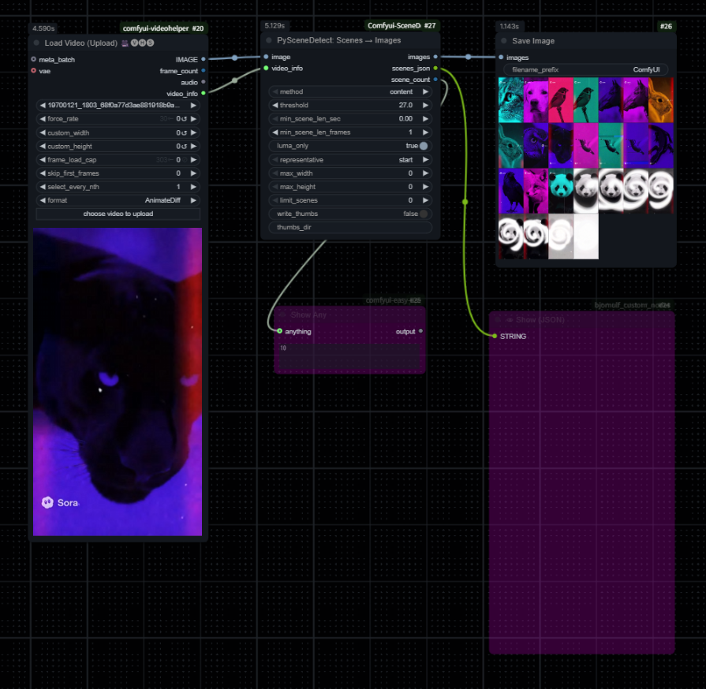

# Comfyui-SceneDetect



Comfyui-SceneDetect adds PySceneDetect-based scene detection to ComfyUI. The recommended node accepts ComfyUI's built-in `VIDEO` type and processes the source without materializing every frame as an `IMAGE` batch. A Legacy VHS node is retained for existing workflows. Both nodes return one representative image per scene, scene metadata as JSON, LLM-ready text, and the detected scene count. The recommended node can also split each scene into a `VIDEO` clip.

## Features

- Direct support for ComfyUI's built-in `Load Video` and `VIDEO` type
- Low-memory processing in the recommended node without materializing the complete video as a float32 `IMAGE` batch
- Backward-compatible Legacy VHS node for existing workflows
- Detection methods from PySceneDetect 0.7: `content`, `adaptive`, `threshold`, `hash`, and `histogram`
- Export one representative frame per scene as an `IMAGE` batch (choose start/middle/end)
- Provide detailed scene metadata as JSON (frame numbers, timestamps, durations, etc.)
- LLM/VLM handoff: one document of every scene (`all_scenes_text`) plus one prompt per scene (`per_scene_prompt_list`)
- Optionally split detected scenes into `VIDEO` clips with ffmpeg
- Optionally store representative frames as JPEG thumbnails
- Detector-specific widgets stay hidden until that `method` is selected (`show_all_settings` reveals every field)

## Requirements

- ComfyUI with built-in `VIDEO` support for the recommended node
- Python 3.10 or newer
- [PySceneDetect 0.7](https://github.com/Breakthrough/PySceneDetect) and OpenCV (installed through this package's dependency list)
- ffmpeg on `PATH` only when using scene clip splitting (`split_clips`)
- [ComfyUI-VideoHelperSuite (VHS)](https://github.com/Kosinkadink/ComfyUI-VideoHelperSuite) only when using the Legacy VHS node

## Installation

Installing from ComfyUI Manager also installs the Python dependencies listed below. For a manual clone:

1. Place this repository under the ComfyUI `custom_nodes` directory.
   - Example: `ComfyUI/custom_nodes/Comfyui-SceneDetect`
2. Install the Python dependencies.

   ```bash
   pip install -r requirements.txt
   ```

   The `requirements.txt` file includes:
   - `scenedetect-headless>=0.7.1,<0.8`
   - `opencv-python-headless>=4.9`
   - `numpy`

   `scenedetect-headless` provides the same `scenedetect` Python module without GUI dependencies.

   PyTorch (`torch`) ships with the standard ComfyUI installation, so it is intentionally not listed here.

3. Restart ComfyUI.

## Node Name and Category

- Node: `PySceneDetect: Video → Scenes` (recommended, built-in `VIDEO` input)
- Legacy node: `PySceneDetect: Scenes → Images (Legacy VHS)`
- Category: `Video/PySceneDetect`

Once installed, the node can be searched and placed directly inside ComfyUI.

### Which node should I use?

| | Recommended | Legacy |
|---|---|---|
| SceneDetect node | `PySceneDetect: Video → Scenes` | `PySceneDetect: Scenes → Images (Legacy VHS)` |
| Loader | ComfyUI built-in `Load Video` | VHS `Load Video (Upload)` |
| Input | Lazy `VIDEO` | Full `IMAGE` batch + `VHS_VIDEOINFO` |
| Memory use | Only compressed video decoding and representative frames | VHS must keep the full float32 frame batch in memory |
| Use case | New workflows and long/high-resolution videos | Existing VHS workflows |

## Inputs and Outputs

### `PySceneDetect: Video → Scenes`

- Required inputs
  - `video` (`VIDEO`): Connect the output from ComfyUI's built-in `Load Video` node. The video is streamed from the compressed source instead of being expanded into a full frame batch.
  - `method` (`content|adaptive|threshold|hash|histogram`): Scene detection method.
  - `threshold` (`FLOAT`): Detection threshold used by the `content`/`threshold` methods. `hash` and `histogram` use their own optional thresholds so the default `27.0` is not applied to the 0–1 range.
  - `min_scene_len_sec` (`FLOAT`): Minimum scene length in seconds. Values greater than zero override `min_scene_len_frames`.
  - `min_scene_len_frames` (`INT`): Minimum scene length in frames, used when `min_scene_len_sec` is `0`.
  - `luma_only` (`BOOLEAN`): Use luma-only detection (content/adaptive only; threshold/hash/histogram ignore this flag).

- Optional inputs
  - `show_all_settings` (`BOOLEAN`): Show every detector field. When false, only widgets used by the selected `method` are visible.
  - `representative` (`start|middle|end`): Position of the representative frame.
  - `max_width` (`INT`): Maximum width of the representative frame (0 disables resizing).
  - `max_height` (`INT`): Maximum height of the representative frame (0 disables resizing).
  - `limit_scenes` (`INT`): Limit the number of scenes processed from the start (0 disables the limit).
  - `write_thumbs` (`BOOLEAN`): Save representative frames as JPEG thumbnails.
  - `thumbs_dir` (`STRING`): Relative directory under ComfyUI's output directory. When empty, thumbnails are written to `output/scene_thumbs`.
  - `split_clips` (`BOOLEAN`): Split each detected scene into a video clip with ffmpeg.
  - `split_dir` (`STRING`): Relative directory under ComfyUI's output directory. When empty, clips are written to `output/scene_clips`.
  - `split_reencode` (`BOOLEAN`): When false, copy streams (`-c copy`). When true, re-encode with libx264.
  - `prompt_template` (`STRING`): Per-scene prompt template for VLM nodes. Empty uses `Scene {index}/{scene_count}: {start_time}–{end_time} ({duration_sec}s). Describe this shot.`
  - Detector extras (ignored when the selected method does not use them): `adaptive_threshold`, `window_width`, `min_content_val`, `delta_hue`, `delta_sat`, `delta_lum`, `delta_edges`, `kernel_size`, `hash_threshold`, `hash_size`, `hash_lowpass`, `hist_threshold`, `hist_bins`, `fade_bias`, `add_final_scene`, `threshold_method`, `start_in_scene`, `downscale`.

- Outputs
  - `images` (`IMAGE`): Representative frame batch (`(B,H,W,C)`). Connect to a VLM node.
  - `scenes_json` (`STRING`): JSON string with scene metadata (includes `video_info`).
  - `scene_count` (`INT`): Number of detected scenes.
  - `all_scenes_text` (`STRING`): Every scene in one text block. Connect to a text LLM for a single call about the whole video.
  - `per_scene_prompt_list` (`STRING` list): One prompt per scene, in the same order as `images`. Connect to a VLM so it runs once per representative frame.
  - `videos` (`VIDEO` list): Scene clips when `split_clips` is enabled; otherwise an empty list.

### `PySceneDetect: Scenes → Images (Legacy VHS)`

The legacy node keeps its original node ID and the original first three outputs so existing workflows continue to load. It also exposes the same extra detector parameters, `all_scenes_text`, and `per_scene_prompt_list`. Clip splitting (`split_clips` / `videos`) exists only on the recommended `VIDEO` node, because the Legacy VHS path has no file-backed source for ffmpeg.

- Connect `IMAGE` output 1 from VHS `Load Video (Upload)` to `image`.
- Connect `VHS_VIDEOINFO` output 4 to `video_info`.
- Do not connect a VAE; latent batches are unsupported.
- The node processes the supplied tensor one frame at a time, but the full VHS `IMAGE` batch still remains resident in memory.

## JSON Output Example (`scenes_json`)

```json
{
  "video_path": "",
  "video_info": {
    "loaded_fps": 29.97,
    "loaded_frame_count": 120,
    "source_fps": 29.97
  },
  "fps": 29.97,
  "method": "content",
  "threshold": 27.0,
  "min_scene_len_frames": 15,
  "representative": "start",
  "scenes": [
    {
      "index": 1,
      "start_frame": 0,
      "end_frame": 153,
      "duration_frames": 153,
      "fps": 29.97,
      "start_time": "00:00:00.000",
      "end_time": "00:00:05.105",
      "duration_sec": 5.105105105105105
    }
  ]
}
```

Each entry in the `scenes` array provides the start/end frame indices, SMPTE-style timestamps, and the duration of the scene. When `split_clips` is enabled, each scene also includes `clip_path`.

## Passing scenes to an LLM or VLM

This package does not call an LLM API. Connect the outputs to existing ComfyUI text or vision nodes (JoyCaption, OpenAI-compatible nodes, Ollama, and similar).

- Text LLM: connect `all_scenes_text` to a `STRING` prompt input. The value is a readable scene list, for example:

```
# Scenes (2)
1. 00:00:00.000 – 00:00:02.000 | 2.000s | frames 0-20
2. 00:00:02.000 – 00:00:04.000 | 2.000s | frames 20-40
```

- VLM: connect `images` to the image input and `per_scene_prompt_list` to the prompt input. `prompt_template` placeholders are `{index}`, `{scene_count}`, `{start_time}`, `{end_time}`, `{duration_sec}`, `{start_frame}`, `{end_frame}`, `{duration_frames}`, and `{clip_path}`.

MediaPipe and other pose/face detectors are not part of PySceneDetect. Use `scenes_json` timestamps if you need to align those tools yourself.

## Usage in ComfyUI

1. Load a video with ComfyUI's built-in `Load Video` node.
2. Add `PySceneDetect: Video → Scenes` and connect the `VIDEO` output directly.
3. Adjust `method`, `threshold`, and `min_scene_len_*` to match the video source.
4. Configure the representative frame position, optional resizing, thumbnail export, clip splitting, and prompt template.
5. Execute the graph to receive representative frames on `images`, metadata on `scenes_json` / `all_scenes_text`, and optional clips on `videos`.

Both samples use ComfyUI's built-in `Preview Image` and `Preview as Text` nodes:

- Recommended: `workflow/pyscene_workflow.json`
- Legacy VHS: `workflow/pyscene_workflow_legacy_vhs.json`

Existing workflows containing `PySceneDetectToImages` continue to load as the Legacy VHS node.

## Memory Behavior

The recommended node receives a lazy `VIDEO` object from ComfyUI's built-in loader. PySceneDetect reads the original compressed file directly, and only the selected representative frames are returned as an `IMAGE` batch. It does not create a full float32 frame batch.

The Legacy VHS path cannot release the frame batch supplied by VHS, but SceneDetect processes that batch one frame at a time without creating full RGB/BGR copies. For new workflows, use the built-in `Load Video` path to avoid the VHS batch allocation entirely.

## Project Layout

- The root `__init__.py` follows the standard ComfyUI structure and registers `nodes`.
- The built-in `VIDEO` implementation lives in `nodes/pyscenedetect_video.py`, the VHS-compatible implementation lives in `nodes/pyscenedetect_to_images.py`, and shared helpers reside in `utils/video_ops.py`.

## Troubleshooting

- High memory use with VHS: Prefer the built-in `Load Video` and `PySceneDetect: Video → Scenes`. The legacy VHS path must keep its full `IMAGE` batch in memory.
- Latent batches in legacy workflows: If a VAE is connected to the VHS `Load Video`, its LATENT output is unsupported. Output RGB frames instead.
- OpenCV fails to open the video: Check codecs and file paths. Confirm that `opencv-python-headless` is installed.
- Clip splitting fails: Confirm `ffmpeg` is on `PATH`. The default is stream copy (`-c copy`), which can miss keyframes or fail when the audio codec cannot be muxed into MP4; the node then retries with libx264. Enable `split_reencode` for frame-accurate cuts from the start.
- PySceneDetect version mismatch: Reinstall within the range defined in `requirements.txt`.
- Empty or 1x1 black output: Indicates the input failed to decode. Validate the source frames and configuration.

## License

This project is licensed under the MIT License. See `LICENSE` for the complete text. Files that specify a different license are governed by the terms noted within those files.

Third-party notices:

- [PySceneDetect](https://github.com/Breakthrough/PySceneDetect) is distributed under the BSD 3-Clause License. When redistributing binaries or source packages that bundle PySceneDetect, ensure that its copyright notice, license
  text, and disclaimer are included alongside your distribution.
